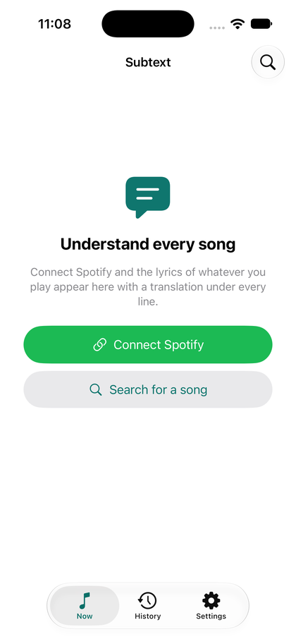
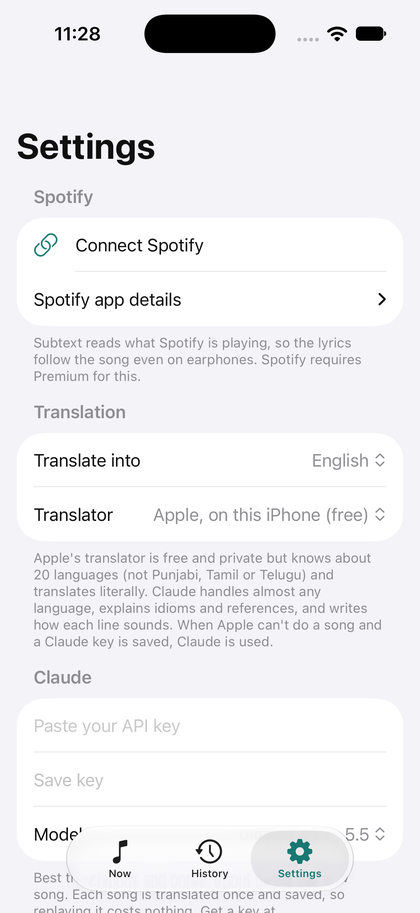

# SubText

**See what your songs mean.** SubText is an iPhone app that follows the song playing in Spotify, shows its lyrics in time with the music, and puts a translation under every line. It also shows how each line sounds and explains idioms and references. The lyrics carry on to the Lock Screen while you listen.

On your phone the app is called **Subtext**.

<p>
  
  &nbsp;&nbsp;
  
</p>

## Features

- **Follows Spotify, even on earphones.** It reads the song and how far into it you are, so the current line is highlighted and the lyrics scroll by themselves.
- **A translation under every line.** Use Apple's translator, which runs on the phone, is free and covers about 20 languages. Or use Claude, which covers almost any language and gives natural meanings.
- **Pronunciation in English letters** for Hindi, Punjabi, Korean, Japanese, Chinese, Russian, Arabic and other scripts.
- **Notes on idioms, slang and cultural references**, plus a short "What it's about" summary of the song (Claude).
- **Ask about any line.** Ask Claude what a word means, why it's said that way, or what it refers to, then ask follow-ups. Answers are saved with the song.
- **Lyrics on the Lock Screen.** A Live Activity shows the line being sung and its translation, and updates as the song plays.
- **Songs outside Spotify.** A Shazam shortcut opens any song playing nearby in SubText.
- **Search and paste.** Find any song by name, or paste lyrics the database doesn't have. Timed LRC lyrics work too.
- **History.** Every song you've read is saved with its translation, so opening it again costs nothing.

## How it works

```
Spotify Web API ──► what's playing + position ─┐
LRCLIB ───────────► lyrics with timestamps ────┼──► SubText ──► Now screen
Apple Translation / Claude ─► translations ────┘          └──► Lock Screen (Live Activity)
```

- **No server.** The app talks directly to Spotify, to [LRCLIB](https://lrclib.net) (a free, open lyrics database), and to Anthropic only if you add a Claude key.
- **Why Spotify's API and not the microphone:** iOS doesn't let one app hear another app's audio, and the microphone hears nothing when you wear earphones. Following Spotify works either way.
- **Lock Screen updates:** a free Apple ID can't receive push updates, so while music plays SubText keeps itself running by playing silence mixed under Spotify. Spotify is never interrupted. The app updates the Lock Screen card whenever the line changes.

## Requirements

| You need | Notes |
| --- | --- |
| A Mac with **Xcode 26 or later** | Built with Xcode 27. Xcode plus the iOS tools need about 25 GB of free disk space. |
| An iPhone on **iOS 18 or later** | Tested on an iPhone 13 Pro running iOS 26.6. |
| An **Apple ID** | A free one works, but the app must be reinstalled every 7 days. The paid Apple Developer Program ($99 a year) makes installs last a year. |
| **Spotify Premium** | Since February 2026, Spotify requires the owner of a developer app to have Premium. |
| An **Anthropic API key** (optional) | For Claude translations. Get one at [console.anthropic.com](https://console.anthropic.com). |

## Setup

### 1. Get the code

```bash
git clone https://github.com/viper-vm/SubText.git
```

```bash
cd SubText
```

### 2. Create a Spotify app

1. Go to [developer.spotify.com/dashboard](https://developer.spotify.com/dashboard) and click **Create app**.
2. App name: anything, for example `SubText`. Description: anything. Leave Website empty.
3. Under **Redirect URIs**, type `subtext://callback` and click **Add**. It must appear in the list under the box.
4. Under "Which API/SDKs are you planning to use?", tick **Web API** only.
5. Agree to the terms and click **Save**.
6. Open the app's **Settings** and copy the **Client ID**. You won't need the Client secret; keep it private.
7. Open **User Management** and add your name and the email of your Spotify account.

### 3. Add your settings

Copy the example settings file. Git ignores `Config/Local.xcconfig`, so your values stay on your Mac.

```bash
cp Config/Local.xcconfig.example Config/Local.xcconfig
```

Open `Config/Local.xcconfig` and fill in:

| Setting | What to put |
| --- | --- |
| `SPOTIFY_CLIENT_ID` | The Client ID from step 2. |
| `DEVELOPMENT_TEAM` | Your Apple team ID (see below). |
| `BUNDLE_ID_PREFIX` | Something unique to you, like `com.yourname`. App IDs are unique across all Apple accounts, so you can't reuse someone else's. |

**Find your team ID.** In Xcode, open Settings → Accounts and sign in with your Apple ID. Then run:

```bash
defaults read com.apple.dt.Xcode IDEProvisioningTeamByIdentifier | grep teamID
```

If you'd rather use Xcode, leave `DEVELOPMENT_TEAM` empty. Open `Subtext.xcodeproj`, then for both the **Subtext** and **SubtextWidgetsExtension** targets, choose your team under Signing & Capabilities.

### 4. Get your iPhone ready

1. In Xcode, open **Settings → Accounts** and make sure your Apple ID is signed in.
2. Plug the iPhone into the Mac with a cable, unlock it, and tap **Trust**.
3. On the iPhone, open **Settings → Privacy & Security → Developer Mode** (at the very bottom), turn it on, and tap **Restart**. After the restart, tap **Turn On**.

   The Developer Mode switch only appears once the phone has been used with Xcode. If you can't find it, run the install script once, or open the project in Xcode with the phone plugged in. Then fully close the Settings app and look again.

## Install on your iPhone

With the phone plugged in, run:

```bash
./install-on-iphone.sh
```

The script finds your iPhone, builds a Release version signed with your Apple ID, installs it and opens it.

**The first time only:**

- **On the Mac:** if a box says "codesign wants to access key…", type your Mac password and click **Always Allow**.
- **On the iPhone:** the app won't open until you trust it. Go to Settings → General → **VPN & Device Management**, tap your Apple ID under Developer App, then tap **Trust**.

**Prefer Xcode?** Open `Subtext.xcodeproj`, pick your iPhone in the toolbar and press Run (⌘R).

### Renewing every 7 days (free Apple ID)

Apps signed with a free Apple ID stop opening after 7 days. Plug the phone in and run `./install-on-iphone.sh` again. Your songs, translations and Spotify sign-in are kept.

## Using SubText

### Follow Spotify

1. Open SubText and tap **Connect Spotify**. Sign in, then tap **Agree**.
2. Play a song in Spotify and switch back to SubText.

The lyrics appear, the current line is highlighted, and the list follows the song.
- **Read ahead:** scroll freely, then tap **Current line** to jump back.
- **Timing:** if the highlight runs ahead of or behind the singing, adjust Settings → **Lyrics timing**.

### Translations

- **Apple (the default):** free and private; the translation happens on the phone. The first time it sees a new language, iOS asks to download it.
  - Covers about 20 languages, including Hindi, Spanish, French, German, Italian, Portuguese, Japanese, Korean, Chinese, Arabic, Russian and Turkish.
  - Doesn't cover Punjabi, Tamil, Telugu or Bengali, or Hindi and Punjabi written in English letters. SubText detects those and uses Claude for them if you've added a key.
- **Claude:** paste your Anthropic API key in Settings → **Claude**.
  - Gives a natural meaning for each line, its pronunciation, notes, and a summary of the song.
  - Each song is translated once and saved.
  - The key is stored in the iPhone's keychain.
- **Claude models and rough cost per new song:**

  | Model | Cost per new song | Notes |
  | --- | --- | --- |
  | Claude Opus 5.5 (default) | 5–10¢ | Best translations |
  | Claude Sonnet 5.5 | 3–5¢ | |
  | Claude Haiku 4.5 | 1–3¢ | Fastest |

- **Translate into:** English by default. You can change it in Settings.
- **Tap any line** to see it larger with its note, play along from there, or copy it.

### Ask about a line

To open a line's sheet, do any of these:
- Tap the line.
- Long-press the line and choose **Ask about this line**.
- Tap **Ask** at the bottom of the screen to ask about the line playing now.

In the sheet, pick a ready-made question ("Explain it word by word", "What does it really mean?", "Any slang or references?", "Explain the grammar", "How do I pronounce it?") or type your own. The answer appears as it's written, in the language you translate into, and you can ask follow-ups.

- **Needs:** a Claude key.
- **Cost:** about a cent or less per question.
- **Saving:** answers are saved with the song, so opening the line again shows them for free.

### Lyrics on the Lock Screen

This is on by default; the switch is Settings → **Lyrics on the Lock Screen**. While a song plays, the Lock Screen shows the current line, how it sounds and its translation, with a progress bar.

- To keep up, SubText runs in the background by playing silence under your music. This uses a little extra battery.
- It stops after **two minutes without music**, or if you **swipe SubText away** in the app switcher. Open SubText to start it again.
- If you swipe the card off the Lock Screen, it stays hidden until the next song.
- If the card says "Open Subtext to keep the lyrics moving", iOS has stopped the app. Open it again.
- Live Activities must be allowed for Subtext. Check this in the iPhone's Settings app → **Subtext**.

### Songs outside Spotify (Shazam shortcut)

1. In the **Shortcuts** app, tap **+** and add the action **Shazam It**.
2. Add the action **Show Lyrics** (from Subtext). Set **Song** to *Shazam Media → Title* and **Artist** to *Shazam Media → Artist*.
3. Name it, for example "What's this song?".
4. To run it by tapping the back of the phone: Settings → Accessibility → Touch → **Back Tap** → Double Tap, then choose the shortcut. You can also run it with Siri or from Control Center.

Shazam listens through the microphone, so it works best when music plays out loud. These songs don't know where the music is. To start the highlight yourself, tap **Play along**, or tap a line and choose **Play along from here**.

### Search, paste and history

- **Search** (magnifying glass): find a song by title and artist.
- **Paste lyrics** (⋯ menu): add lyrics for the current song or a new one. Timed LRC lines like `[01:02.30] …` scroll with the song.
- **History:** every song you've opened, with its translation and answers saved. Swipe a song to delete it. To remove all saved translations and answers, use Settings → **Clear saved translations and answers**.

## Privacy

- **Spotify:** SubText asks Spotify only what's playing. It uses the `user-read-currently-playing` and `user-read-playback-state` permissions. Sign-in uses PKCE, and the sign-in token is kept in the iPhone's keychain.
- **LRCLIB:** receives the song's title, artist, album and length to find its lyrics.
- **Apple's translator:** runs on the phone and sends nothing.
- **Claude (only if you add a key):** the song's title, artist and lyric lines are sent to Anthropic's API. When you ask about a line, Anthropic receives that line, the three lines either side of it, the song's summary and your question.
- **Everything else stays on the phone:** saved songs, translations and settings. There are no analytics and no SubText server.

## Limitations

- SubText follows Spotify rather than listening to it, because iOS doesn't let apps hear each other. Other apps work through the Shazam shortcut.
- Lyrics come from LRCLIB. Some songs are missing or have no timing, especially new or regional releases. You can paste lyrics for those.
- With a free Apple ID you must reinstall every 7 days.
- Lock Screen lyrics depend on the app staying in the background. If iOS ends it (low memory, or you force-quit it), the card stops until you open SubText.
- A Spotify app in development mode allows up to 5 users. Each one must be added under User Management.

## Troubleshooting

| Problem | What to do |
| --- | --- |
| Developer Mode isn't in Settings | Run the install script once, or open the project in Xcode with the phone plugged in. Then force-close Settings and look again at the bottom of Privacy & Security. |
| No Trust button in VPN & Device Management | It appears only after the app is installed. Run the install script first. |
| Build error: "Developer Mode disabled" | Turn on Developer Mode, let the phone restart, then tap Turn On. |
| Build error about signing or the development team | Set `DEVELOPMENT_TEAM` in `Config/Local.xcconfig` and check your Apple ID is signed in under Xcode → Settings → Accounts. |
| "Failed to register bundle identifier" | Change `BUNDLE_ID_PREFIX` to something unique. |
| "codesign wants to access key…" keeps appearing | Click **Always Allow**, not Allow. |
| Spotify shows an `INVALID_CLIENT` or redirect URI error | The dashboard must list exactly `subtext://callback`, and `SPOTIFY_CLIENT_ID` must match your app. Run the install script again after changing it. |
| Spotify says "Spotify refused (403)…" | Add your Spotify account under User Management. The app's owner needs Premium. |
| The app won't open after about a week | Free signing has expired. Run the install script again. |
| "No lyrics found" | Search with a different spelling, or paste the lyrics. |
| The Lock Screen card stops moving | Open SubText. Check that Settings → Lyrics on the Lock Screen is on and that Live Activities are allowed. |

## Development

```
Subtext/            the app
  App/              app entry, AppModel (song on screen, Spotify polling, line clock, translation),
                    Lock Screen controller, background audio
  Lyrics/           LRCLIB client, LRC parser
  Spotify/          PKCE sign-in, currently-playing API
  Translate/        Claude API client, streaming translator, "ask about a line", language detection,
                    romanization
  Storage/          settings, keychain, saved songs (one JSON file per song)
  Intents/          the "Show Lyrics" Shortcuts action
  Views/            Now, History, Settings, search, paste, line details
SubtextWidgets/     the Lock Screen Live Activity (widget extension)
Shared/             code compiled into both the app and the widget
Config/             xcconfig and Info.plist files (Local.xcconfig is yours and not committed)
Tests/CoreTests/    checks for the core logic, run on the Mac
scripts/            test-core.sh
```

- The Xcode project uses folder-synchronized groups, so new files in `Subtext/`, `SubtextWidgets/` or `Shared/` are picked up automatically.
- **Core checks** (run on the Mac; the LRCLIB check needs internet):

  ```bash
  ./scripts/test-core.sh
  ```

- **Simulator.** Debug builds read a few environment variables, so screens can be checked without tapping:

  ```bash
  SIMCTL_CHILD_SUBTEXT_DEMO_QUERY="Bella Ciao" SIMCTL_CHILD_SUBTEXT_DEMO_LINE=6 xcrun simctl launch booted io.github.vipervm.subtext
  ```

  - `SUBTEXT_DEMO_TAB=settings` or `history` opens a tab.
  - `SUBTEXT_DEMO_ASK="question"` with `SUBTEXT_DEMO_ASK_LINE=3` opens that line's sheet and asks the question.
  - `SUBTEXT_CLAUDE_URL` and `SUBTEXT_CLAUDE_KEY` point translations at a test server.
  - Apple's translator doesn't run in the simulator; use a real iPhone for that.

## Credits

- Lyrics from [LRCLIB](https://lrclib.net).
- Translations by Apple's Translation framework and by [Claude](https://www.anthropic.com/claude) from Anthropic.

## License

MIT. See [LICENSE](LICENSE). The license covers SubText's code. The lyrics the app shows come from LRCLIB and belong to their rights holders.
